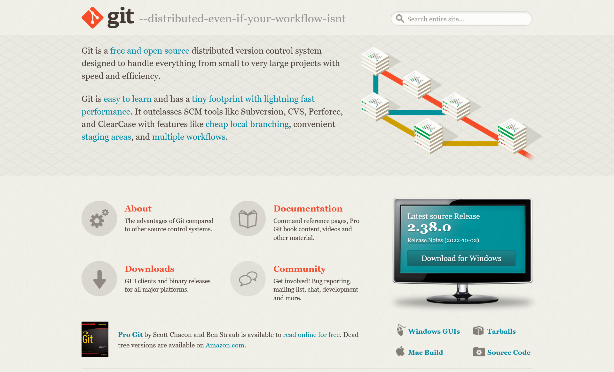
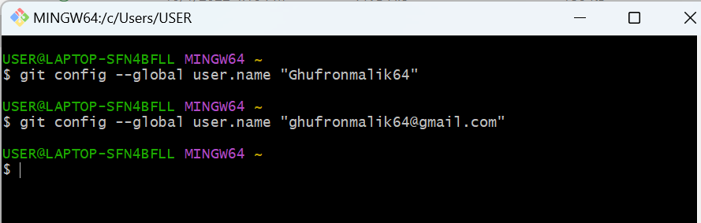
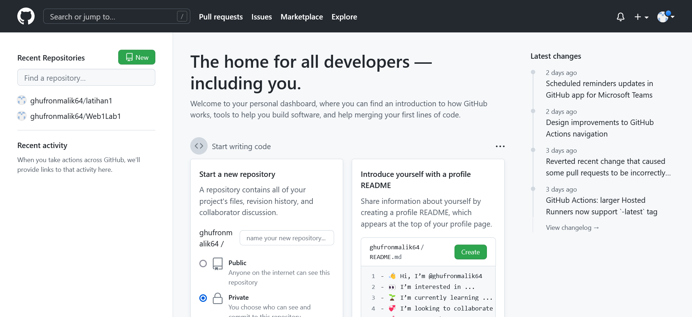

# Latihan VCS

## 1. Dwonload Git

Pastikan kalian sudah dwonload Git terlebih dahulu
-https://git-scm.com/downloads

## 2. Configurasi Nama atau Email

Pastikan kalian sudah terdaftar pada Web resmi GitHub lalu masukan nama atau email agar tidak terjadi kesalahan saat kalian melakukan perintah git commit
$git config --global user.name "username anda"
$git config --global user.email "email anda"

## 3. Login

Login GitHub

## 4. Buat Repositori Baru