# Latihan VCS

## 1. Dwonload Git

Pastikan kalian sudah mendwonload Git terlebih dahulu

- *https://git-scm.com/downloads*

## 2. Configurasi Nama atau Email

Lalu masukan nama atau email agar tidak terjadi kesalahan saat kalian melakukan perintah git commit.

* $git config --global user.name "username anda"
* $git config --global user.email "email anda"

## 3. Login

Sebelumnya pastikan anda sudah terdaftar atau memiliki akun GitHub, lalu Login GitHub

## 4. Membuat Repositori Baru

Setelah berhasil Login anda bisa membuat Repositori dengan cara klik tombol "New" pada tampilan awal GitHub

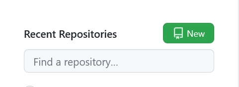

Kemudian kalian akan di arahkan pada halaman New Repositori

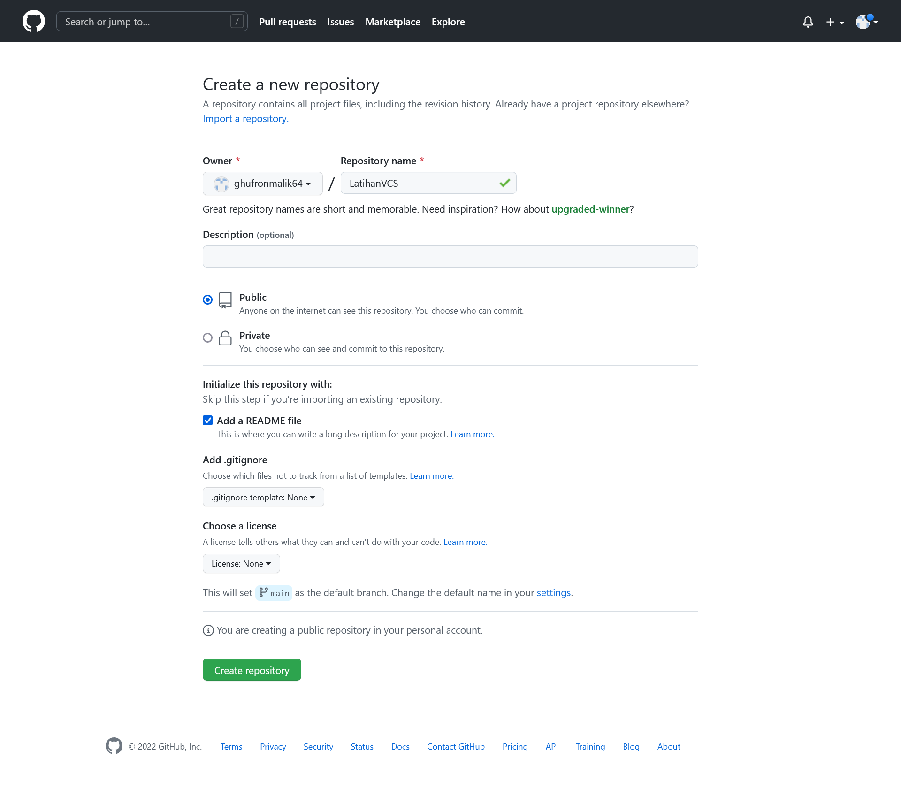

## 5. Membuat Folder Pada Lokal Disk

Buat folder baru di lokal disk anda

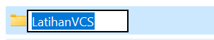

Setelah membuat folder baru, klik kanan pada folder tersebut, lalu klik "Git Bash Here". Maka akan muncul aplikasi Pop-up Git Bash

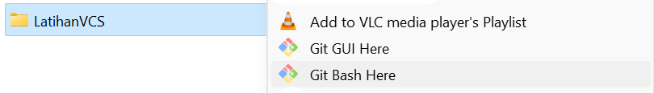

## 6. Membuat Folder Pada Git Bash

Buat folder baru dan arahkan Git Bash pada file direktori

* $mkdir tutorial
* $cd tutorial

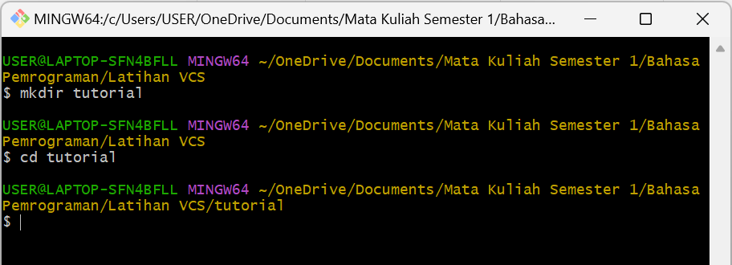

## 7. Menambahkan Judul Dalam File README.md

Tambahkan judul atau Header ke dalam file README.md yang nantinya akan dimasukan ke dalam Repositori yang kita buat

* $echo "#latihanvcs" >> README.md

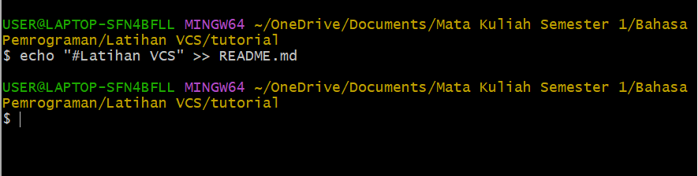

## 8. Membuat Repositori Lokal

Kemudian buat Repositori lokal menggunakan perintah *git init*

* $git init

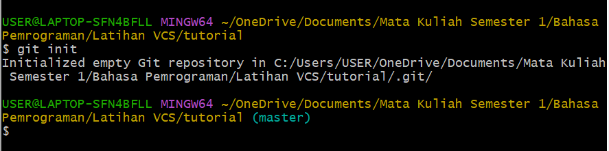

## 9. Memasukan file README.md ke Repositori

Masukan file README.md yang diberi judul tadi kedalam Repositori menggunakan perintah *git add*

* $git add README.md

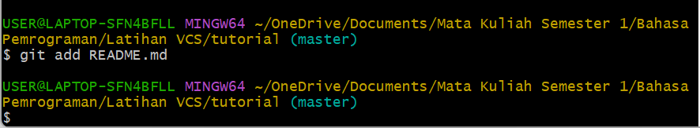

## 10. Mengonfirmasi Perubahan

Bila sudah ditambahkan, simpan dan konfirmasi perubahan dengan komentar menggunakan perintah *git commit -m "contoh commit"*

* $git commit -m "commit pertama"

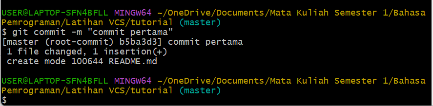

## 11. Menambahkan Repositori Jarak Jauh

Remote Repositori merupakan server repositori yang akan digunakan untuk menyimpan setiap perubahan pada repositori lokal, sehingga dapat diakses oleh banyak pengguna. caranya gunakan perintah *git remote add origin 'url'

* $git remote add origin https://github.com/ghufronmalik64/latihanvcs.git

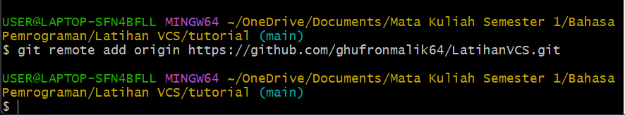

## 12. Mengirim perubahan

Untuk mengirim perubahan pada Repositori lokal ke server gunakan perintah *git push -u origin 'branch'*

* $git push -u origin master

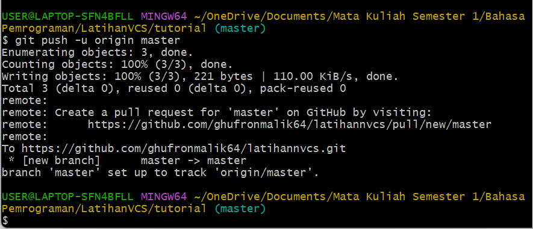

## Dan terakhir anda bisa cek hasil Repositori pada Website GitHub

# _____________________________________________________
# DI KASIH TUGAS HARI SENIN. TERIMAKASIH SUDAH NEMENIN. 
